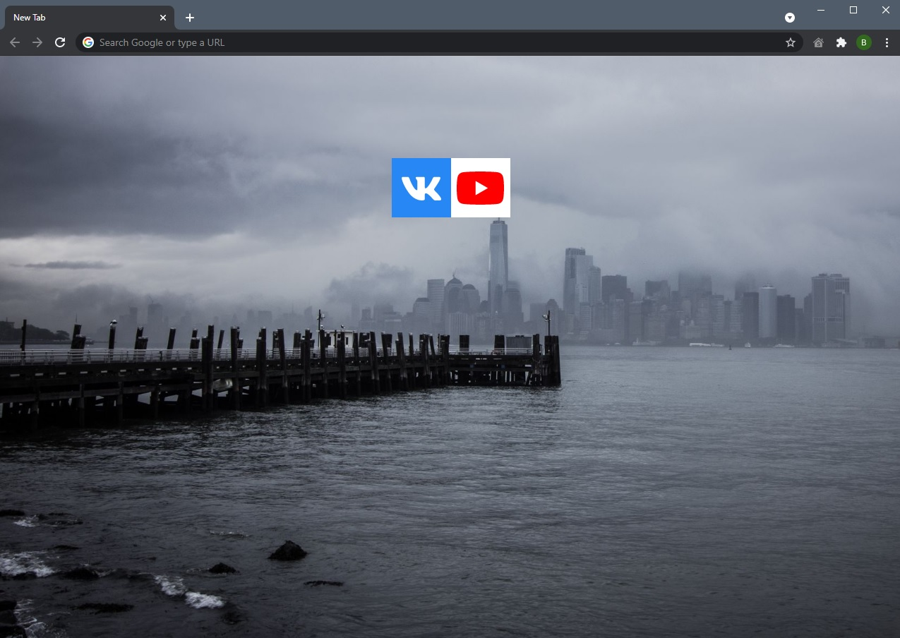
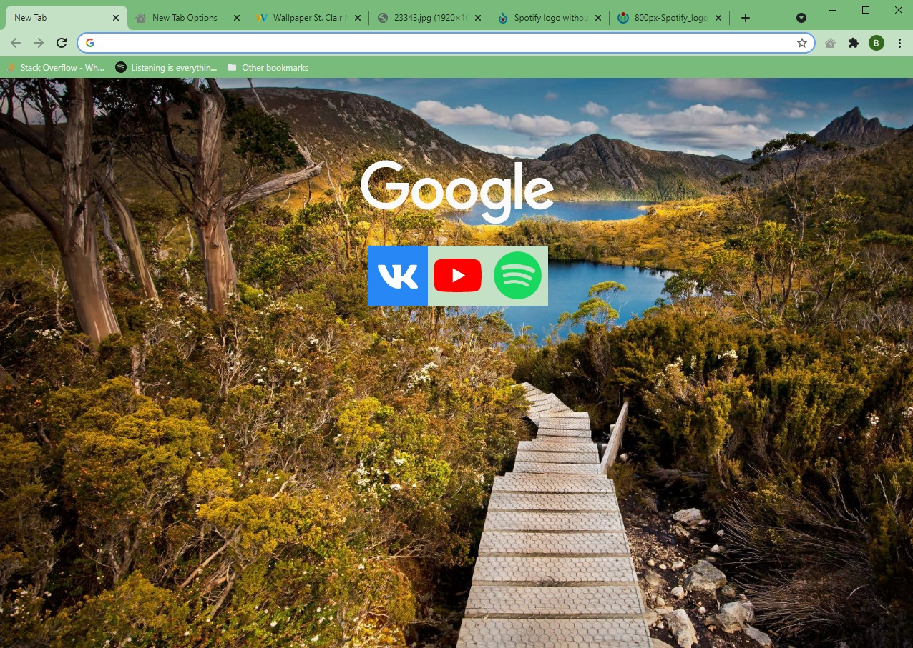
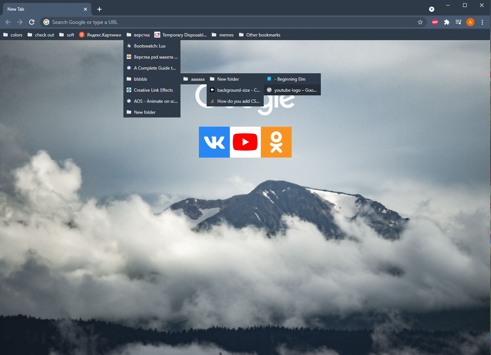

# Minimalistic Start Page

Simple "New Tab" for Google Chrome web browser.

### Features
 - Customizable background
 - Tiles for quick access links
 - Bookmarks bar

### How to install

- Go to chrome://extensions/
- Turn on developer mode
- Click "Load upacked"
- Choose source code folder

### How to use

- Right click on extension icon
- Go to extention option
- Customize!

### How it looks

